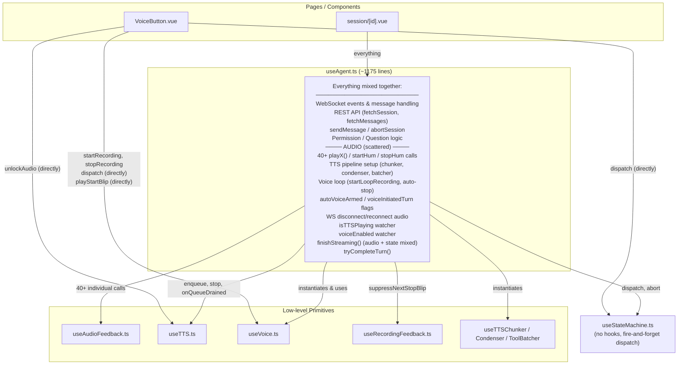

# Current Audio Architecture

How audio cues, TTS, and voice loop are wired today. The core problem: everything is mixed into `useAgent.ts` with 40+ scattered imperative audio calls.

## Problems Visible

1. **`useAgent.ts` is a god-composable** — agent communication, audio cues, TTS pipeline, voice loop all in one file
2. **VoiceButton bypasses useAgent** — directly calls `useVoice`, `useStateMachine`, `useAudioFeedback`, and `useTTS` independently
3. **No listener system on the state machine** — audio cues manually placed next to each `dispatch()` call
4. **Shared state is ad-hoc** — some refs use `useState` (shared), some use `ref` (local), no ownership convention
