# Future Audio Architecture

Target architecture after the audio orchestrator refactor. Audio cues are driven by state machine transition hooks, not scattered imperative calls.

```mermaid
graph TB
    subgraph "Pages / Components"
        PAGE["session/[id].vue"]
        VB["VoiceButton.vue"]
        APP["app.vue"]
    end

    subgraph "useAgent.ts"
        direction TB
        AG_WS["WebSocket events<br/>(subscribe, send)"]
        AG_MSG["Message handling<br/>(msgBuilder, handleAgentEvent)"]
        AG_REST["REST API<br/>(fetchSession, fetchMessages)"]
        AG_SEND["sendMessage()"]
        AG_PERM["Permission / Question logic"]
        AG_STREAM["isStreaming, suppressInitialTools"]
    end

    subgraph "useAudioOrchestrator.ts"
        direction TB
        ORC_HOOKS["SM Transition Hooks<br/>──────────────────<br/>→ agent_turn: hum, consume autoVoiceArmed<br/>agent_turn → idle: success chime<br/>abort: cancel tone, TTS 'Stopped.'<br/>→ awaiting_input: permission/question chime<br/>→ user_turn (loop): loop tick"]
        ORC_TTS["TTS Pipeline<br/>──────────────────<br/>chunker → condenser → enqueue<br/>tool batcher → summaries<br/>feedTextDelta(), feedToolEvent()"]
        ORC_VOICE["Voice Loop<br/>──────────────────<br/>startLoopRecording()<br/>auto-stop → STT → sendMessage callback<br/>toggleRecording() (for VoiceButton)<br/>toggleVoice()"]
        ORC_WATCH["Reactive Watchers<br/>──────────────────<br/>isTTSPlaying → stop hum<br/>voiceEnabled → cleanup<br/>connectionState → warn/reconnect"]
        ORC_FLAGS["Internal Flags<br/>──────────────────<br/>autoVoiceArmed, agentDone<br/>abortedTurn, loopStartPending"]
    end

    subgraph "useSessionState.ts"
        direction LR
        SS["Shared Reactive State<br/>─────────────────────────<br/>isStreaming (owner: useAgent)<br/>voiceEnabled (owner: orchestrator)<br/>voiceInitiatedTurn (owner: orchestrator)<br/>suppressInitialTools (owner: useAgent)<br/>loopRecordingActive (owner: orchestrator)"]
    end

    subgraph "useStateMachine.ts"
        direction TB
        SM_STATES["States: idle → user_turn → agent_turn → idle<br/>agent_turn ⇄ awaiting_input"]
        SM_HOOKS["onTransition(cb)<br/>──────────────────<br/>Notifies after dispatch() and abort()<br/>cb(from, to, action, trigger)"]
    end

    subgraph "Low-level Primitives (unchanged)"
        AF["useAudioFeedback.ts<br/>──────────────────<br/>playHandoff, playSuccessChime,<br/>startWorkingHum, stopWorkingHum,<br/>playErrorTone, playCancelTone, ..."]
        TTS["useTTS.ts<br/>──────────────────<br/>enqueue, stop, isPlaying<br/>onQueueDrained, unlockAudio"]
        VOICE["useVoice.ts<br/>──────────────────<br/>startRecording, stopRecording<br/>isRecording, silence detection"]
        RF["useRecordingFeedback.ts<br/>──────────────────<br/>start/stop blips"]
        CHUNK["useTTSChunker / Condenser / ToolBatcher"]
    end

    %% Page → useAgent
    PAGE -- "sendMessage, abortSession,<br/>fetchSession, messages" --> AG_SEND
    PAGE -- "isBusy, isStreaming,<br/>isTTSPlaying, isRecording" --> AG_REST

    %% Page → Orchestrator (via useAgent return)
    PAGE -- "toggleVoice(), stopPlayback()" --> ORC_VOICE
    VB -- "toggleRecording()" --> ORC_VOICE
    APP -- "unlockAudio()<br/>(first tap, one-shot)" --> TTS

    %% useAgent → Orchestrator
    AG_MSG -- "feedTextDelta()" --> ORC_TTS
    AG_MSG -- "feedToolEvent()" --> ORC_TTS
    AG_MSG -- "notifyStreamingDone()" --> ORC_FLAGS
    AG_SEND -- "creates orchestrator,<br/>passes sendMessage callback" --> ORC_VOICE
    AG_PERM -- "announcePermission()<br/>announceQuestion()<br/>announceAnswer()" --> ORC_TTS

    %% Orchestrator → sendMessage (callback)
    ORC_VOICE -. "onTranscription(text)" .-> AG_SEND

    %% Orchestrator → SM
    ORC_HOOKS -- "registers onTransition()" --> SM_HOOKS

    %% SM → Orchestrator
    SM_HOOKS -. "notifies (from, to, action, trigger)" .-> ORC_HOOKS

    %% useAgent → SM
    AG_SEND -- "dispatch('start_agent_turn')" --> SM_STATES
    AG_MSG -- "dispatch('complete_turn')<br/>dispatch('await_input')" --> SM_STATES

    %% Shared State
    AG_STREAM -- "writes" --> SS
    ORC_FLAGS -- "writes" --> SS
    ORC_VOICE -- "reads" --> SS
    AG_SEND -- "reads" --> SS
    PAGE -- "reads" --> SS

    %% Orchestrator → Primitives
    ORC_HOOKS -- "playHandoff, startWorkingHum,<br/>stopWorkingHum, playSuccessChime, ..." --> AF
    ORC_TTS -- "enqueue, stop" --> TTS
    ORC_TTS -- "chunker, condenser,<br/>tool batcher" --> CHUNK
    ORC_VOICE -- "startRecording, stopRecording,<br/>silence detection" --> VOICE
    ORC_VOICE -- "playStartBlip" --> RF

    %% Orchestrator watches
    ORC_WATCH -- "watches isPlaying" --> TTS
    ORC_WATCH -- "watches connectionState" --> AG_WS
```

## Key Improvements

1. **`useAgent.ts` is agent-only** — WebSocket, messages, REST, permissions. No audio logic.
2. **VoiceButton is a thin trigger** — calls `orchestrator.toggleRecording()`, no direct primitive access.
3. **Audio cues are declarative** — mapped to SM transitions via hooks, not imperative calls.
4. **Shared state is explicit** — `useSessionState` with documented owners.
5. **iOS audio works** — early `unlockAudio()` in `app.vue` on first interaction.
