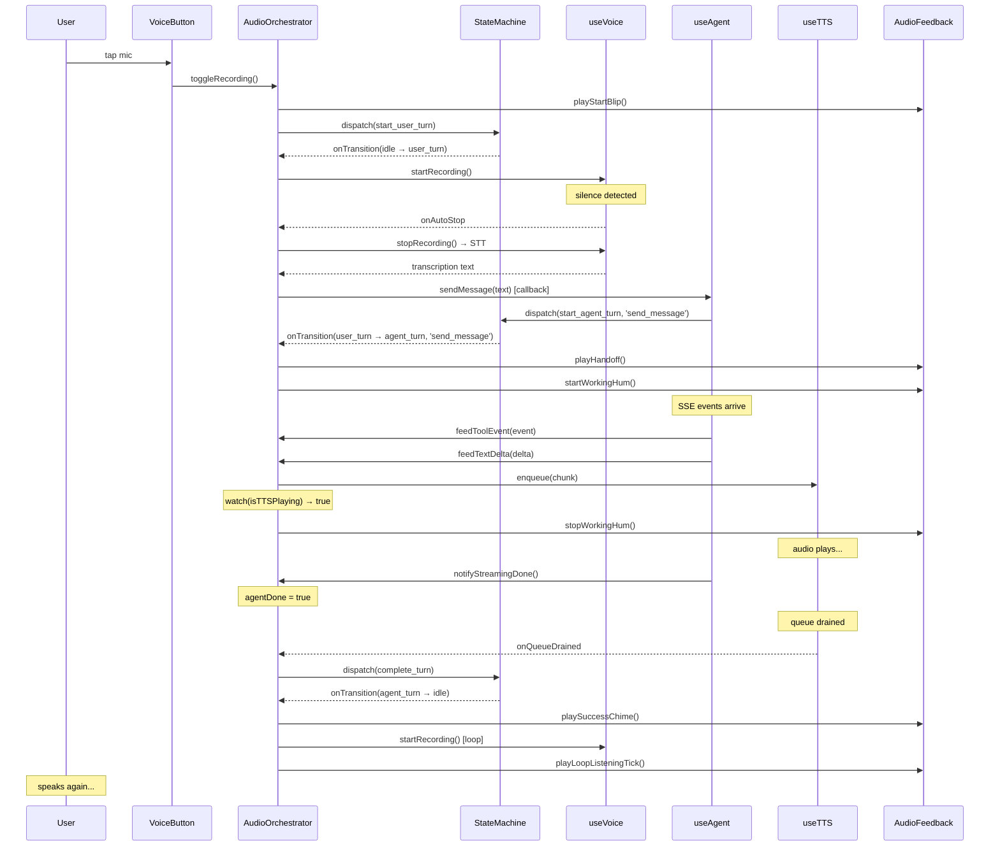

# Voice Conversation Turn — Sequence Diagram

The most common scenario: user taps mic, speaks, agent responds with TTS, mic auto-restarts for the next turn.



## Audio Timeline for One Turn

```
[user taps mic]
  │ start blip (660Hz, 80ms)
  │
  │ ... user speaks ... silence detected ...
  │
  │ handoff tone (C5→E5, ~170ms)
  │ working hum starts (40BPM heartbeat, vol 0.20)
  │
  │ ... agent does tools ... text starts streaming ...
  │
  │ hum stops (TTS about to play)
  │ TTS speech plays
  │
  │ ... agent finishes ...
  │
  │ success chime (C5→E5→G5, ~280ms)
  │ loop tick (1200Hz, 30ms) — mic auto-starts
  │
  │ ... next turn ...
```

## Other Scenarios

### Auto-voice new session (tools then text)

```
[page loads, autoVoiceArmed = true]
  │
  │ → agent_turn (session_busy_on_load or auto_voice_initial)
  │ working hum starts
  │ autoVoiceArmed consumed → voiceInitiatedTurn = true
  │
  │ ... agent does suppressed tools ... text arrives ...
  │
  │ hum stops (TTS starts)
  │ TTS speech plays
  │ success chime
  │ loop tick — mic auto-starts
```

### Auto-voice new session (tools only, no text)

```
[page loads, autoVoiceArmed = true]
  │
  │ → agent_turn
  │ working hum starts
  │ autoVoiceArmed consumed → voiceInitiatedTurn = true
  │
  │ ... agent does suppressed tools ... done ...
  │
  │ hum stops
  │ (no success chime — suppressInitialTools still true)
  │ loop tick — mic auto-starts
```

### Abort mid-response

```
[user taps stop]
  │
  │ orchestrator.handleAbort()
  │ abort('abort_session') → SM force-resets to idle
  │ onTransition(agent_turn → idle, abort, 'abort_session')
  │ stop hum
  │ cancel tone (500→350Hz, 120ms)
  │ TTS "Stopped."
  │ (no mic restart — abort ends the loop)
```
