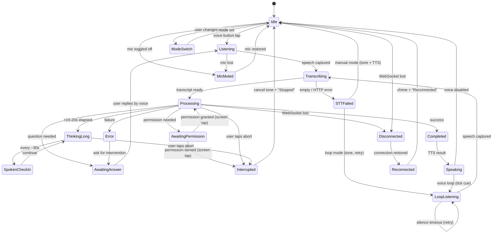

# Plan: Audio Feedback State System

**Status:** draft
**Created:** 2026-04-05
**Author:** user + agent

## Goal

Replace the current ad-hoc audio cues (start blip, stop blip, thinking jingle) with a coherent audio feedback system that eliminates ambiguity about what Voilot is doing. The core problem: when using voice-first workflows, users can't tell if the mic is off, the agent is thinking, or the agent has been working silently for 30 seconds.

## Context

### Current Audio Feedback (What Exists)

All audio is generated programmatically in `useRecordingFeedback.ts` -- no static audio files.

| Sound | Frequency | Duration | Trigger |
|-------|-----------|----------|---------|
| Start blip | 660 Hz | 80ms | Manual tap to start recording |
| Stop blip | 440 Hz | 80ms | Manual tap to stop recording |
| Thinking jingle | 523 Hz + 659 Hz (ascending) | 170ms | Message sent to agent |

**Blips are already suppressed** during the automatic voice loop (`loopRecordingActive === true`) and only play on explicit user taps.

### Current Visual Feedback (Comprehensive)

- Pulsing dot in ChatView (color-coded: blue=responding, amber=permission, indigo=question)
- VoiceButton with recording animation, audio level ring, status text, indicator dots
- Color-coded chat messages for permissions, questions, tools, errors
- Service health indicator (green/yellow/red dot)
- Round-trip timing visualization bar

### Known Pain Points

- Mic-off vs. agent-thinking is indistinguishable by audio alone
- Long-running agent work (>5s) produces dead silence after the thinking jingle
- "Awaiting your answer" and "awaiting permission" are not distinct from thinking
- Double beeps occur from overlapping event sources (e.g. recording stop + message send)

### Gaps Identified by Screenless UX Audit

A code-level trace of every audio path was performed to identify what a user who **never looks at the screen** actually hears. Seven gaps were found and are addressed in this spec. One (voice-based permission responses) is deferred as a separate feature.

#### Gap 1: Permission requests require screen interaction (DEFERRED)

`useAgent.ts:120` explicitly blocks the voice loop when `hasPendingPermission` is true. After TTS announces "Permission needed: ...", the user **must** tap a button on screen. There is no voice path for "allow" / "always" / "reject". This is a fundamental "no screen" blocker but requires a voice command router, which is out of scope for this plan. Tracked in AGENTS.md Known Issues.

#### Gap 2: STT failure is a silent black hole

When STT returns empty text or the HTTP request fails (`useVoice.ts:400-403`), `VoiceButton.vue:156-157` shows "No speech detected" **visually only**. In voice loop mode (`useAgent.ts:144`), it silently retries. The spec's watchdog doesn't help because failure occurs **before** `sendMessage()` -- the hum never starts.

**Fix:** Add an `STT_FAILED` audio path. On empty/failed transcription, play a soft failure tone + TTS "I didn't hear anything." In loop mode, play the tone but skip TTS to avoid interrupting the flow, then retry.

#### Gap 3: Voice loop has no "mic is hot" indicator

When loop auto-starts recording (`useAgent.ts:125`), all blips are suppressed. The user has **zero audio indication** that the mic is now listening. After the success chime and TTS finish, the mic silently goes hot.

**Fix:** Add a `LOOP_LISTENING` cue -- a very short, subtle tick (distinct from start blip) that plays when the voice loop auto-starts recording. Must be quiet enough to not feel like the "constant beeping" the user wanted to eliminate, but present enough to confirm the mic is live.

#### Gap 4: Tool-only responses produce total silence

If the agent uses tools but produces no text, `useAgent.ts:391` calls `ttsToolBatcher.flushSilent()` which discards the tool batch. Single-tool invocations are never announced (`MIN_TOOLS_TO_ANNOUNCE = 2`). User hears: thinking jingle -> 10-30s of nothing -> loop recording.

**Fix:** The working hum covers the active period. Spoken check-ins should include context: "Still working, running tools..." instead of generic "Still working..." when tool events have been received. The success chime on `done` marks the end.

#### Gap 5: Abort flow is audio-dead

When the user taps stop (`useAgent.ts:463`), TTS cuts off abruptly, then silence. No confirmation.

**Fix:** Add an `INTERRUPTED` audio path. After `stopTTS()`, play a cancel tone + brief TTS "Stopped." Stop the working hum.

#### Gap 6: WebSocket disconnect is invisible

Connection state changes (`useWebSocket.ts` reconnect cycle) only update a visual dot in `StatusIndicator.vue`. Subsequent `sendMessage()` calls fail silently at `useAgent.ts:458`.

**Fix:** Add `DISCONNECTED` and `RECONNECTED` audio paths. On disconnect: warning tone + TTS "Connection lost." On reconnect: subtle chime + TTS "Reconnected." Stop the working hum on disconnect.

#### Gap 7: Double-beep root cause and fix

The "double beep" is the stop blip (440 Hz, 80ms) firing ~500-3000ms before the handoff tone (523+659 Hz, 170ms). They're close enough to sound like one stuttered event. The STT round-trip determines the gap.

**Fix:** When a voice-originated message is about to be sent, suppress the stop blip. The handoff tone subsumes it -- the user hears one clean transition from "I stopped talking" to "agent is working." Implement by checking `voiceInitiatedTurn` in the stop blip watcher.

#### Gap 8: Question chime can overlap working hum

If the agent sends a `question_request` mid-stream, `stopWorkingHum()` and `playQuestionChime()` could fire in parallel.

**Fix:** Enforce strict ordering: `stopWorkingHum()` must resolve (hum audio fully stopped) **before** `playQuestionChime()` fires. Same applies to permission chime, error tone, and success chime -- all require hum to be stopped first. This is an implementation constraint in `useAudioFeedback.ts`.

## Design Decisions

All decisions were made interactively with the user.

| Decision | Choice | Rationale |
|----------|--------|-----------|
| Working loop vibe | **Soft ambient hum** | Non-intrusive, clearly indicates "something is active" |
| Long run behavior | **Fade out ~15-20s, spoken check-in every ~30s** | Avoids annoying continuous drone; spoken status keeps user informed |
| Question cue | **Chime + spoken question (TTS) always** | Ensures user never misses a question requiring input |
| Watchdog timeout | **5 seconds** | Balanced -- catches failed transcription without false positives |
| Mic toggle sound | **Keep existing blips, only on explicit user tap** | Already implemented correctly with loop suppression |
| Error granularity | **One generic error cue, differentiate visually** | Keeps audio simple; visual UI already shows error details |

## Interaction State Model

Three parallel dimensions (avoids state explosion):

- **Mode** (work type): `planning` | `coding`
- **Interaction** (what is happening now): `idle` | `listening` | `transcribing` | `thinking` | `executing` | `awaiting_input` | `awaiting_permission` | `speaking` | `done`
- **Health** (system condition): `ok` | `mic_muted` | `mic_denied` | `network_degraded` | `network_offline` | `error`

## Simplified Audio Contract

One guiding principle: **exactly one audio behavior at a time, with clear ownership**.

### Audio Priority (highest wins)

1. Critical alerts (error, permission, mic lost)
2. Question prompt (chime + TTS)
3. Working hum loop
4. Non-critical UI cues (mic toggle blip)

### State-to-Audio Mapping

```
IDLE
  Audio: silence
  Visual: neutral badge

LISTENING (mic open, capturing — manual tap)
  Audio: start blip (once, manual tap only — already implemented)
  Visual: pulsing mic ring + "Listening..." label

LOOP_LISTENING (mic open, capturing — voice loop auto-start)
  Audio: subtle tick (once, distinct from start blip, very quiet)
  Visual: pulsing mic ring (same as manual listening)
  Notes: Must confirm mic is hot without feeling like "constant beeping."
         Plays after success chime + TTS finish, before silence detection starts.

TRANSCRIBING
  Audio: silence (too brief to need feedback)
  Visual: "Transcribing..." label

STT_FAILED (transcription returned empty or HTTP error)
  Audio:
    - Manual mode: soft failure tone + TTS "I didn't hear anything."
    - Loop mode: soft failure tone only (no TTS, to avoid interrupting flow), then retry
  Visual: "No speech detected" label (already exists)
  Notes: This fires BEFORE sendMessage() — the watchdog never starts.

SUBMITTED -> PROCESSING (agent working)
  Audio:
    1. Handoff tone (single, replaces current thinking jingle)
       — Stop blip is SUPPRESSED for voice-originated messages (handoff subsumes it)
    2. Working hum loop starts immediately
    3. Hum fades out over ~15-20s
    4. Spoken check-in every ~30s: "Still working..." or "Still working, running tools..."
       (includes tool context if tool events have been received)
    5. Hard cap at 90s: stop hum, spoken "Agent is still working, please wait"
  Visual: pulsing dot + "Agent is responding..."

AWAITING USER ANSWER (agent asks a question)
  Audio:
    1. Stop working hum (MUST complete before step 2)
    2. Play question chime (once)
    3. Speak question via TTS
  Visual: indigo pulsing dot + question card + "Answer a question..."

AWAITING PERMISSION (file/system permission needed)
  Audio:
    1. Stop working hum (MUST complete before step 2)
    2. Play permission chime (once, distinct from question chime)
    3. Speak reason via TTS
  Visual: amber pulsing dot + allow/deny card + "Waiting for approval..."
  Notes: Voice loop is blocked — user MUST interact via screen.
         Voice-based permission responses are a separate future feature.

COMPLETED (agent done)
  Audio:
    1. Stop working hum (MUST complete before step 2)
    2. Play success chime (once)
  Visual: success indication

ERROR (any severity)
  Audio:
    1. Stop working hum (MUST complete before step 2)
    2. Play generic error tone (once)
    3. TTS speaks: "An error occurred" (brief)
  Visual: error card with details (recoverable vs fatal differentiated visually)

INTERRUPTED (user tapped stop/abort)
  Audio:
    1. Stop TTS playback (abrupt cutoff — already implemented)
    2. Stop working hum
    3. Play cancel tone (once)
    4. TTS speaks: "Stopped." (brief)
  Visual: input area returns (isBusy becomes false)

DISCONNECTED (WebSocket connection lost)
  Audio:
    1. Stop working hum (if active)
    2. Play warning tone (once)
    3. TTS speaks: "Connection lost."
  Visual: red dot in StatusIndicator

RECONNECTED (WebSocket connection restored)
  Audio:
    1. Play subtle reconnect chime (once)
    2. TTS speaks: "Reconnected."
  Visual: green dot in StatusIndicator

MIC MUTED (mic toggled off by user)
  Audio: stop blip (once, manual tap only — already implemented)
  Visual: persistent slashed mic icon

MIC PERMISSION DENIED (OS/browser blocked)
  Audio: warning tone (once)
  Visual: warning banner with fix instructions

MODE SWITCH
  Audio: short mode signature tone (once)
  Visual: mode chip transition
```

### Pre-Submit Failure: STT Empty/Error

```
recording_stopped:
  -> STT HTTP request sent

if STT returns empty text or HTTP error:
  -> play soft STT failure tone
  -> if manual mode: TTS "I didn't hear anything."
  -> if loop mode: skip TTS, retry recording after short delay (~500ms)
  -> do NOT start working hum or watchdog (message was never sent)
```

### Watchdog: Preventing Infinite Hum

```
submit_pressed:
  -> suppress stop blip (if voice-originated — handoff tone subsumes it)
  -> play handoff tone
  -> start working hum immediately
  -> start 5s watchdog timer

if agent acknowledges (SSE event received) within 5s:
  -> cancel watchdog
  -> keep hum running until terminal state

if watchdog fires (no acknowledgment in 5s):
  -> stop hum
  -> play soft "could not process" tone
  -> TTS: "I didn't catch that. Please try again."
```

### De-duplication Rules

- Debounce identical cues within 700ms
- `startHum()` is idempotent (no-op if already active)
- `stopHum()` is idempotent (no-op if already stopped)
- Only one audio owner at a time (priority list above)
- **Stop blip suppression:** When `voiceInitiatedTurn` is true and a message is about to be sent, suppress the stop blip. The handoff tone provides the transition cue. This eliminates the "double beep" (stop blip at 440 Hz followed 500-3000ms later by handoff tone at 523+659 Hz).
- **Hum-before-chime ordering:** All chimes/tones that interrupt the hum (question, permission, success, error, cancel) MUST call `stopWorkingHum()` and wait for it to complete before playing their cue. No parallel firing.

## Mermaid State Diagram



## New Sounds to Generate

All sounds will follow the existing pattern: programmatic sine-wave generation via `generateSineBlip()` in `useRecordingFeedback.ts`, encoded as WAV blobs, played via `HTMLAudioElement`.

| Sound | Character | Frequency/Pattern | Duration | Volume |
|-------|-----------|-------------------|----------|--------|
| **Handoff tone** | Replace current thinking jingle | Keep 523+659 Hz ascending (already good) | 170ms | 0.25 |
| **Working hum** | Soft ambient drone | ~150 Hz sine, very low volume, looped | Continuous, fade out 15-20s | 0.08-0.12 |
| **Question chime** | Attention-getting, friendly | 880 Hz + 1047 Hz descending | 200ms | 0.25 |
| **Permission chime** | Distinct from question, slightly urgent | 587 Hz + 440 Hz descending | 200ms | 0.30 |
| **Success chime** | Resolved, positive | 523 Hz + 659 Hz + 784 Hz ascending triad | 300ms | 0.20 |
| **Error tone** | Generic, noticeable but not harsh | 330 Hz | 200ms | 0.30 |
| **Warning tone** | For mic denied / disconnect | 440 Hz + 330 Hz alternating | 300ms | 0.25 |
| **Mode signature** | Brief identity cue | 392 Hz single tap | 100ms | 0.15 |
| **Loop-listening tick** | Subtle "mic is hot" confirmation | 1200 Hz single tick | 30ms | 0.10 |
| **STT failure tone** | Soft "didn't catch that" | 350 Hz descending to 280 Hz | 150ms | 0.20 |
| **Cancel tone** | Abort confirmation | 500 Hz descending to 350 Hz | 120ms | 0.20 |
| **Reconnect chime** | Connection restored | 600 Hz + 800 Hz ascending | 150ms | 0.15 |

## Implementation Approach

### 1. New composable: `useAudioFeedback.ts`

Central audio manager that owns all sound playback and enforces the priority/de-duplication rules. Replaces direct calls to `playThinkingJingle()` from `useAgent.ts`.

Responsibilities:
- Generate and cache all Audio elements on init (12 sounds total)
- Expose: `playHandoff()`, `startWorkingHum()`, `stopWorkingHum()`, `playQuestionChime()`, `playPermissionChime()`, `playSuccessChime()`, `playErrorTone()`, `playWarningTone()`, `playModeSignature()`, `playLoopListeningTick()`, `playSTTFailureTone()`, `playCancelTone()`, `playReconnectChime()`
- `stopWorkingHum()` returns a Promise that resolves when audio is fully stopped (enables ordered chime playback)
- Manage hum fade-out timer (15-20s) and spoken check-in interval (30s)
- Track whether tool events have been received to add context to check-in messages ("Still working, running tools...")
- Enforce priority: stop hum before playing chimes; debounce within 700ms
- Watchdog timer: stop hum + play failure cue if no agent ACK in 5s

### 2. Refactor `useRecordingFeedback.ts`

- Keep start/stop blips (they work well)
- Remove `playThinkingJingle()` -- replaced by `playHandoff()` in the new composable
- Add stop-blip suppression: check a shared `suppressStopBlip` flag (set by `useAgent.ts` when voice-originated message is about to send). This eliminates the double-beep.

### 3. Wire into `useAgent.ts`

Replace `playThinkingJingle()` call (line 440) with `playHandoff()` + `startWorkingHum()`.

Add calls at state transitions:
- `question_request` event -> `await stopWorkingHum()` then `playQuestionChime()` (before TTS speaks the question)
- `permission_request` event -> `await stopWorkingHum()` then `playPermissionChime()`
- `done` / `session.idle` event -> `await stopWorkingHum()` then `playSuccessChime()`
- `error` event -> `await stopWorkingHum()` then `playErrorTone()`
- `status:busy` -> ensure hum is running (idempotent)
- `status:idle` -> ensure hum is stopped (idempotent)
- `abortSession()` -> `stopTTS()` then `await stopWorkingHum()` then `playCancelTone()` then TTS "Stopped."
- Before `sendMessage()` for voice-originated: set `suppressStopBlip = true`
- On tool_use/tool_result events: notify `useAudioFeedback` that tools are active (for check-in context)
- On `startLoopRecording()`: call `playLoopListeningTick()`

### 4. Spoken check-ins for long runs

In `useAudioFeedback.ts`, after hum fade-out (~15-20s):
- Start a 30s interval
- On each tick, call TTS `enqueue(message)` where message includes tool context if available:
  - Tools active: "Still working, running tools..."
  - No tools: "Still working..."
- Clear interval on any terminal state

### 5. Watchdog integration

In `useAgent.ts` `sendMessage()` flow:
- After sending message: call `startWatchdog(5000)`
- On first SSE event for this message: call `cancelWatchdog()`
- On watchdog timeout: `stopWorkingHum()` + `playErrorTone()` + TTS "I didn't catch that"

### 6. STT failure feedback

In `VoiceButton.vue` `finishRecording()` or the voice loop auto-stop handler in `useAgent.ts`:
- When STT returns empty/null: call `playSTTFailureTone()`
- If manual mode: also TTS "I didn't hear anything."
- If loop mode: skip TTS, retry after ~500ms delay

### 7. WebSocket disconnect/reconnect feedback

In `useWebSocket.ts` or a watcher on `connectionState`:
- On `connected -> disconnected`: `await stopWorkingHum()` then `playWarningTone()` then TTS "Connection lost."
- On `disconnected -> connected`: `playReconnectChime()` then TTS "Reconnected."

### 8. Mode switch sound

In mode toggle handler (session page or `useAgent.ts`):
- Call `playModeSignature()` on plan/implement toggle

## Files to Modify

| File | Change |
|------|--------|
| `frontend/composables/useAudioFeedback.ts` | **New** -- central audio manager with 12 sounds, hum lifecycle, watchdog, check-ins |
| `frontend/composables/useRecordingFeedback.ts` | Remove `playThinkingJingle`, add stop-blip suppression flag |
| `frontend/composables/useAgent.ts` | Replace jingle call, add chime/hum/cancel calls at state transitions, add watchdog, add loop-listening tick, suppress stop blip for voice messages, notify tool activity |
| `frontend/composables/useWebSocket.ts` | Add disconnect/reconnect audio cue hooks (or watchers in useAgent) |
| `frontend/pages/session/[id].vue` | Add mode switch sound on toggle |
| `frontend/components/VoiceButton.vue` | Add STT failure tone in `finishRecording()` fallback path |

## Acceptance Criteria

- [ ] Working hum starts immediately when a message is submitted to the agent
- [ ] Working hum fades out after ~15-20s of continuous agent work
- [ ] Spoken check-in plays every ~30s during long agent runs, with tool context when applicable
- [ ] Working hum stops on: agent done, agent error, question received, permission request, abort, disconnect
- [ ] Question chime + spoken question plays when agent asks a question
- [ ] Permission chime + spoken reason plays when agent needs permission
- [ ] Success chime plays when agent completes
- [ ] Generic error tone plays on any error
- [ ] Watchdog stops the hum and plays failure cue if no agent response within 5s
- [ ] No double-beep: stop blip suppressed for voice-originated messages; handoff tone subsumes it
- [ ] Hum is fully stopped before any interrupting chime/tone plays (strict ordering)
- [ ] Mic start/stop blips only play on explicit user tap (not during voice loop) -- already works
- [ ] Subtle tick plays when voice loop auto-starts recording (confirms mic is hot)
- [ ] STT failure plays a soft tone; in manual mode also TTS "I didn't hear anything"
- [ ] Abort plays cancel tone + TTS "Stopped." after stopping TTS and hum
- [ ] WebSocket disconnect plays warning tone + TTS "Connection lost."
- [ ] WebSocket reconnect plays chime + TTS "Reconnected."
- [ ] Mode switch plays a short signature tone
- [ ] All sounds are programmatically generated (no static audio files)
- [ ] iOS Safari audio works (HTMLAudioElement approach, not Web Audio oscillators while mic is open)
